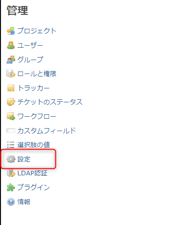
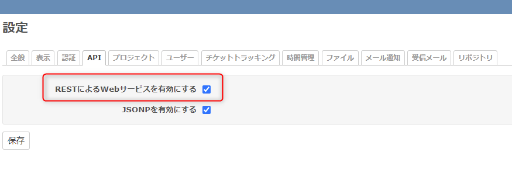
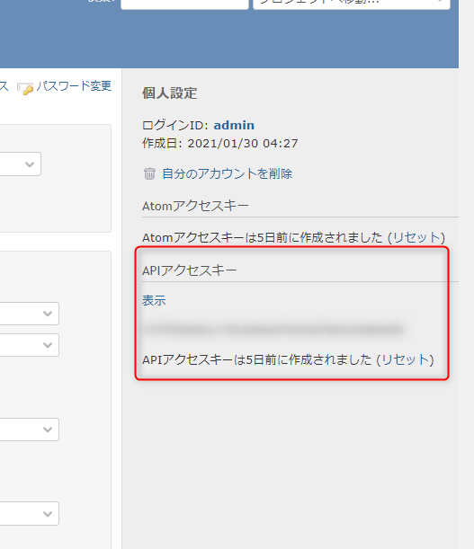

# redump


> REDUMP is a tool to migrate data in your Redmine without admin accounts.

You can use the API to retrieve tickets in Redmine, save them in JSON format, and migrate them to another Redmine.

[](LICENSE)
[](https://github.com/RichardLitt/standard-readme)
[](https://github.com/tubone24/redump/actions)
[](https://coveralls.io/github/tubone24/redump?branch=main)

## Table of Contents

- [Background](#background)
- [Install](#install)
- [Usage](#usage)
- [Contributing](#contributing)
- [License](#license)

## Background

When you migrate a Redmine project to another Redmine, you have to dump the DB that is used behind the scenes, which is a job that only a server administrator can do.

However, many Redmine administrators don't like to do that and won't do it. 

In that case, users can move the necessary tickets manually, but this is not practical when the number of issue tickets or files is too many.

If the project can use the Redmine API, I thought I could use the Redmine API to achieve the same thing.

This is because I try to make this tool.

### Features

- You can save Redmine Isssues in JSON format with attachments.
- You can migrate issues to other Redmine.
- You can create a list of users from an Issue without administrative privileges.
- Access via HTTP Proxy is supported.

## Install

### Quick Install

[Download binary!](https://github.com/tubone24/redump/releases)

### Manual Install

#### System Requirements

- Go(v1.12 and more)

This project is implemented using Go, so you will need to install Go beforehand.

#### Build

When building success, artifacts exists `main(.exe)` in root directory.

```
make build
```

#### Run

If you want to run the code directly, use the run command, which allows you to specify options in the ARGS options.

```
make run ARGS="dump"
```

## Usage

#### precondition

First, you need to make sure that you can use Redmine API for both Redmine source and destination. (need admin account!)





Then, you can get an API key from your account settings.



Second, put Redmine's server information in `TOML` format in the `config.toml` file.
 
We have prepared `config.toml.example` as a template, so we will copy that first.

```toml
[server] # source server
url = "https://example.com"
key = "xxxxx" # API Key
project_id = 1 # if you want to choose several project's issues
sleep = 3000 # request sleep millisecond
timeout = 10000 # timeout(millisecond) if no response over that time
proxy_url = "http://127.0.0.1:8080" # If you use http proxy, set proxy url, port, user/pass

[new_server] # new server
url = "https://blog.tubone-project24.xyz"
key = "xxxxx" # API Key
project_id = 1 # if you want to choose several project's issues
sleep = 3000 # request sleep millisecond
timeout = 10000 # timeout(millisecond) if no response over that time
proxy_url = "http://127.0.0.1:8080" # If you use http proxy, set proxy url, port, user/pass
```

If you have created similar `project`, `tracker`, `status`, `priority`, `user`, and `custom fields` in the destination, you can create issue tickets correctly on the migration server side by specifying the ID mapping.

```toml
[[mappings]]
  name = "project_id"
  [[mappings.values]]
    old = 7
    new = 9
  [[mappings.values]]
    old = 11
    new = 2
```

### How to use

Redump is a command line tool, so it consists of a few commands and options.

```
Usage:
  redump migrate [-i|--issue <number>]
  redump list
  redump dump [-c|--concurrency] [-i|--issue <number>]
  redump restore [-i|--issue <number>]
  redump clear [-o|--old]
  redump -h|--help
  redump --version

Options:
  -h --help                  Show this screen.
  -c --concurrency           Concurrency Request Danger!
  -i --issue                 Specify Issues
  -o --old                   Old Server
  --version                  Show version.
```

For Example, if you want to copy issues from old Redmine to new Redmine, you can use migrate command.

```
$ redump migrate
```

It is also possible to focus only on specific issues.

set `-i` option and issues number.

```
$ redmup migrate -i 133
```

## Contributing

See [the contributing file](.github/CONTRIBUTING.md)!

PRs accepted.

Small note: If editing the Readme, please conform to the [standard-readme](https://github.com/RichardLitt/standard-readme) specification.

### Testing

Write and run test code for the target code before submitting a PR.

```
make test
```

If you have a higher PR on performance to go along with it, it is recommended to run benchmark tests as well.

```
make bench
```

## License

[MIT © tubone24](LICENSE)
